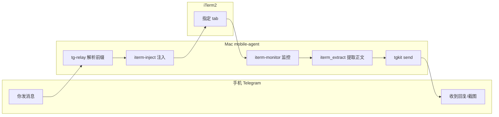
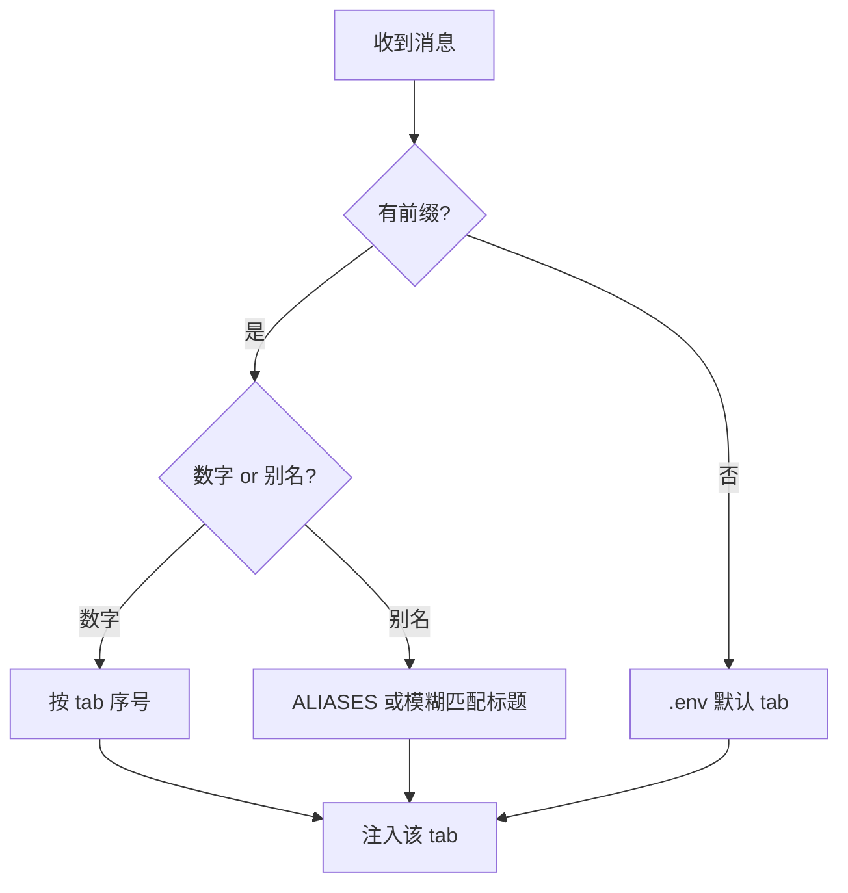

# iTerm 多标签页路由 — 使用指南

> 用手机 Telegram 向不同目录/项目的 iTerm 标签页发指令，助手回复后自动回传 Telegram。  
> 前置：[Telegram 配置](TELEGRAM_SETUP.md)

---

## 1. 解决什么问题

你可能同时在 iTerm 里开了多个标签页，每个对应不同项目：

```
┌─ iTerm Window 1 ─────────────────────────────────────────────┐
│  tab1          tab2              tab3           tab11        │
│  ~/weather     ~/number02        ~/agents       ~/mobile-agent │
│  (node)        (node)            (-zsh)         (-zsh)       │
└──────────────────────────────────────────────────────────────┘
```

以前只能改 `.env` 里的 `TG_ITERM_TAB` 切换目标。现在可以**在 Telegram 消息里加前缀**，一次对话里随意指定 tab，无需改配置。

---

## 2. 整体架构



**一条消息的完整生命周期：**

```
Telegram 消息
    │
    ▼
┌─────────────────┐
│ 解析前缀         │  [t2] / [mobile-agent] / @fz:
│ iterm_route.py  │
└────────┬────────┘
         │ 目标: w1/t11
         ▼
┌─────────────────┐
│ 注入 iTerm       │  模拟键盘输入 + 回车
│ iterm-inject.py │
└────────┬────────┘
         │
         ▼
┌─────────────────┐     ┌──────────────────────────┐
│ iTerm 执行       │ ──► │ 本地日志缓冲              │
│ Claude Code     │     │ inbox/iterm-session-*.log │
└────────┬────────┘     └──────────────────────────┘
         │
         ▼ (延迟 TG_ITERM_MONITOR_AFTER 秒后)
┌─────────────────┐
│ 轮询 + 提取正文  │  过滤提示符，识别完成标记
│ iterm-monitor   │
└────────┬────────┘
         ▼
    Telegram 回复（纯文字；久无新内容可发截图）
```

---

## 3. 快速开始（5 步）

### 第 1 步：配置 `.env`

```bash
cd mobile-agent
cp .env.example .env
# 填写 TELEGRAM_BOT_TOKEN、TELEGRAM_CHAT_ID
```

最少需要：

```bash
TELEGRAM_BOT_TOKEN=你的token
TELEGRAM_CHAT_ID=你的chat_id
TG_RELAY_ITERM_INJECT=1          # 自然语言 → 注入 iTerm
TG_ITERM_MONITOR_AFTER=45        # 注入后 45 秒开始抓取回传
```

### 第 2 步：增大 iTerm 滚动缓冲（推荐，只需一次）

```bash
./mob iterm-buffer-setup
```

避免长回复被 iTerm 默认 1000 行限制截断。

### 第 3 步：查看当前有哪些 tab

```bash
./mob iterm-list
```

示例输出：

```
Window 1:
  tab 3: '..agents-skills (-zsh)'
    [t3] / @t3:   TG_ITERM_WINDOW=1 TG_ITERM_TAB=3
  tab 11: '../mobile-agent (-zsh)'
    [t11] / @t11: TG_ITERM_WINDOW=1 TG_ITERM_TAB=11
```

### 第 4 步：启动全套服务

```bash
./mob up
```

同时启动 `tg-relay`（收消息）和 `iterm-monitor`（回传输出）。

### 第 5 步：在 Telegram 发消息

```
[mobile-agent] 查看当前 git 状态
```

Bot 会回复类似：

```
typed into iTerm tab 11 (../mobile-agent (-zsh))
查看当前 git 状态
(+ inbox backup)
(output -> TG after delay)
```

约 45 秒后，助手回复会发回 Telegram。

---

## 4. 消息前缀 — 如何指定 tab

发消息时，**前缀 + 空格 + 正文**。前缀会被剥掉，只有正文注入 iTerm。

### 4.1 按标签序号

| 写法 | 示例 | 说明 |
|------|------|------|
| `[tN]` | `[t3] 列出目录` | 最常用，N = tab 序号 |
| `[tab:N]` / `[tab N]` | `[tab:3] hello` | 同上 |
| `#N` | `#3 hello` | 简写 |
| `@tN:` / `@N:` | `@t3: hello` | @ 风格 |

```
Telegram 输入:  [t3] 帮我看下 package.json
                      └─ 路由到 tab 3
注入 iTerm 正文: 帮我看下 package.json
```

### 4.2 按目录 / 项目名（模糊匹配）

iTerm 标签标题通常包含当前目录片段，例如 `../mobile-agent (-zsh)`。

| 写法 | 示例 | 匹配规则 |
|------|------|----------|
| `[目录名]` | `[mobile-agent] 跑测试` | tab 标题中含 `mobile-agent` |
| `@目录名:` | `@dwj_online: 查日志` | 同上 |

### 4.3 按 `.env` 别名（精确映射）

多个 tab 目录名相同时，用别名最稳：

```bash
# .env
TG_ITERM_ALIASES=fz:1:7,mobile:1:11,dwj:1:6
# 格式: 别名:窗口号:标签号
```

| 写法 | 示例 |
|------|------|
| `[fz]` | `[fz] 查一下部署状态` |
| `@mobile:` | `@mobile: 重启服务` |

### 4.4 无前缀 — 使用默认 tab

不写前缀时，走 `.env` 默认值：

```bash
TG_ITERM_WINDOW=1    # 窗口 1；填 front = 最前窗口
TG_ITERM_TAB=11      # 默认 tab 11
```

---

## 5. 示意图：多项目并行使用

```
  [mobile-agent] 修 bug          ──► tab 11
  [t3] 更新文档                   ──► tab 3
  @fz: 看下编译                   ──► tab 7 (别名)
  无前缀的消息                    ──► .env 默认 tab
```

各 tab 独立注入、独立回传，状态文件：`inbox/iterm-monitor-w1-t{N}.*`

**路由决策：**



---

## 6. Telegram 命令

| 命令 | 作用 |
|------|------|
| `/tabs` | 列出 iTerm 标签及推荐前缀 |
| `/help` | 帮助 |
| `/check` | 环境检查 |

自然语言消息 → 注入 iTerm + 备份到 `inbox/pending.txt`。

---

## 7. 本地 CLI

```bash
./mob up
./mob down
./mob tg-status
./mob iterm-list
./mob iterm-route "[mobile-agent] test"
```

---

## 8. 常见问题

| 现象 | 处理 |
|------|------|
| 消息进了错误 tab | 发 `/tabs`；目录重复时配置 `TG_ITERM_ALIASES` |
| 前缀不生效 | 重启 mobagent up |
| 无回传 | 检查 `TG_ITERM_MONITOR_AFTER` |
| 回复被截断 | `./mob iterm-buffer-setup` |

---

## 9. 相关文档

- [TELEGRAM_SETUP.md](TELEGRAM_SETUP.md)
- [INSTALL.md](INSTALL.md)
