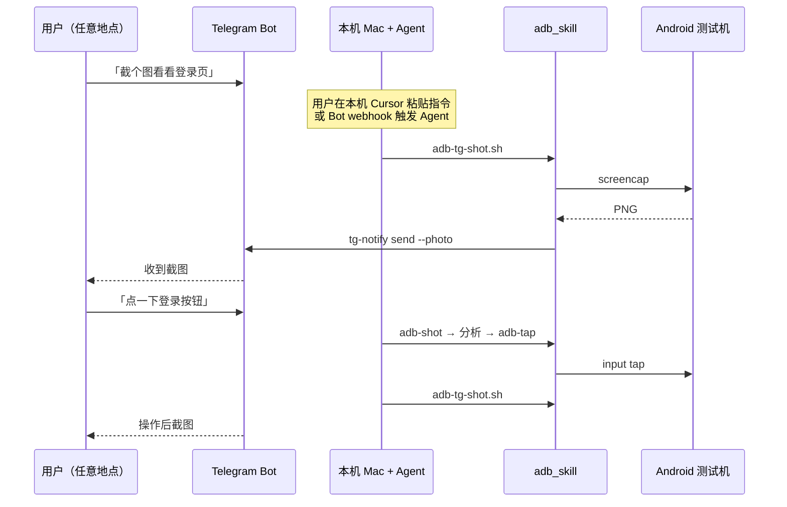

# Telegram 远程 + ADB 本地操作工作流

通过 **Telegram 远程发令** + **本机 AI Agent** + **adb_skill** 控制 USB 连接的 Android 手机，并把截图/结果回传到 Telegram。

---

## 架构



## 所需组件

| 组件 | 路径 | 作用 |
|------|------|------|
| adb_skill | `droid-ctl-skill/` | 控制 Android |
| tg-notify | `tg-notify/` | 发 Telegram 消息/图片 |
| tg_skill | `tg-notify-skill/` | Agent 知道如何调 tg-notify |
| tg-relay | `tg-relay.py` | Bot 收令（可选） |
| .env | `mobile-agent/.env` | `TELEGRAM_BOT_TOKEN` |

## 一次性配置

```bash
cd mobile-agent

cp .env.example .env
# 编辑 TELEGRAM_BOT_TOKEN、TELEGRAM_CHAT_ID

./mob setup --only tg,adb --test
./mob check
```

## 三种协作模式

### 模式 A：人工中转（最简单，立即可用）

1. 你在外面用 Telegram 给自己发指令（或发给 Bot 对话记录）
2. 回到 Mac，在 Cursor 告诉 Agent：「按 Telegram 上的指令操作手机」
3. Agent 执行 `adb_skill` 脚本，用 `adb-tg-shot.sh` 回传结果

**优点**：零开发，Skill 已够用。  
**缺点**：需要你在 Mac 前触发 Agent。

### 模式 B：Telegram Bot + 本机 Agent 半自动

1. `./mob tg-start` 运行 `tg-relay.py`，接收 Bot 消息
2. 自然语言写入 `inbox/pending.txt`，结构化命令直接执行
3. Agent 读取待办 → 执行 adb → `tg-notify` 回复

**适合**：远程发令 + 本地 Agent 协作。

### 模式 C：全自动远程

Bot 收到结构化命令（如 `/shot`、`/tap 540 1200`）→ `tg-relay` 直接调 `droid-ctl` → `tg-notify` 回复。  
由 `tg-relay.py` 实现，启动：`./mob tg-start`。

## Agent 推荐话术

安装 **adb** + **tg** 两个 Skill 后：

| 你说 | Agent 应做 |
|------|-----------|
| 把手机画面发到 Telegram | `adb-tg-shot.sh` |
| adb 截图分析是不是主界面 | `adb-analyze.sh --ui` → 读图 |
| 点登录按钮 | shot → 分析坐标 → `adb-tap.sh` → 再 shot |
| 安装 apk 并截图 | `adb-install.sh` → `adb-start.sh` → `adb-tg-shot.sh` |

## 安全注意

- Bot Token 勿提交 git；泄露后 @BotFather `/revoke`
- 远程 tap/swipe 等同远程控制真机，建议专用测试机
- 生产用户设备慎用自动化点击
- 指令确认：破坏性操作前 Agent 应询问

## 相关命令

```bash
# 截图并发 TG
droid-ctl-skill/scripts/adb-tg-shot.sh -c "远程验收"

# 仅本地截图给 AI
droid-ctl-skill/scripts/adb-analyze.sh --ui

# 检查两端环境
droid-ctl-skill/scripts/check-env.sh --with-tg
./mob check

# Bot 收令
./mob tg-start
```
